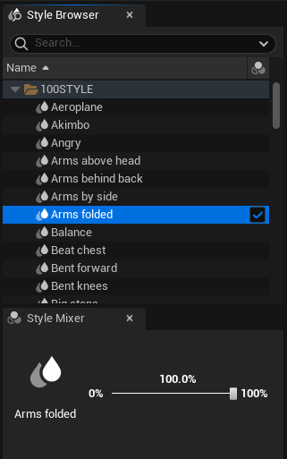
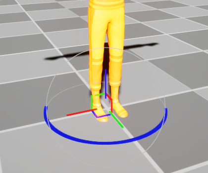
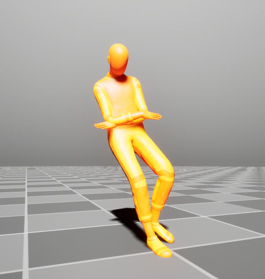

# Generate Animations

Currently, animations can be generated only in Motorica Studio Editor. This section describes different workflows for generating animations.

## Create Animation for Preset Path

1. Enable [*Preset Mode*](ui-editor-modes.md#preset-mode)

    

2. Choose a preset type in the *Preset Controls* panel and configure its parameters.

    

3. Select one or more styles in the *Style Browser*.

    

4. Press *Generate Animation*.

    

    A notification will appear when the animation is ready.

    

    The animation will be inserted into the *Animation* track of the *Locomotion Actor*.

    

5. [Preview your animation.](#preview-generated-animation)

## Create Animation for Custom Path

1. Enable [*Keyframe Mode*](ui-editor-modes.md#keyframe-mode)

    

2. Add a *Locomotion Actor* to the scene.

    

3. Select the Actor by left-clicking it in the viewport.

    

4. Set the current frame in the *Timeline* to `0`.

    

5. Move and rotate the Actor using the viewport gizmo.
    
    

    !!! tip
        You can precisely set the values for location and rotation in the following places:
        
        - the channel value in the *Timeline* track
        - the channel value in *Sequencer Curves*
        - the channel value in the *Details* panel under "Transform", as long as the *Actor* is selected
        
6. Set the keyframe for *Location* and *Rotation* channels.

    

    

    !!! tip
        Enable "auto-key" in the *Timeline* to automatically create keys when you move the character with the gizmo.

        

7. Move the scrubber in the *Timeline* to another frame.

    

8. Repeat steps 4 to 6 until you are ready with your path.

    

9. Select one or more styles in the *Style Browser*.

    

10. Press *Generate Animation*.

    

    A notification will appear when the animation is ready.

    

    The animation will be inserted into the *Animation* track of the *Locomotion Actor*.

    

11. [Preview your animation.](#preview-generated-animation)

## Preview Generated Animation

Generated animations are applied to the corresponding Locomotion Actor and can be previewed in the viewport.

Drag the playback scrubber or press *Play* to preview your animation.

## Save Animation as Animation Asset

You can save an animation as an `Animation Sequence` asset to your project and use it like any other animation. To do so, press the *Save Animation* button in the details panel.

!!! note
    Make sure that you have selected a locomotion actor in the viewport. Otherwise, you will not see the options in the *Details* panel.

A *Save As* dialog box will appear.

1. Select a **folder** where you want to save the animation.
2. Write the **name** of your animation asset.
3. Press **Save** to save the animation in your project.

You can find the saved animation via the *Content Browser*.

Double-click the *Animation Sequence* asset to preview it using the default UE *Animation Editor*.

## Export as FBX

`Animation Sequence` assets can be exported to FBX. This is default functionality provided in the Unreal Engine `Animation Editor`.

To export the animation as FBX:

1. Double-click on the `Animation Asset`

    

    

2. Click *Export Asset > Animation Data* and export using the default settings.

    

    !!! note
        The image above is using UE 5.3. Other UE versions may show a different UI.
   
[Download UE Plugin](#){ .md-button .md-button--primary }
