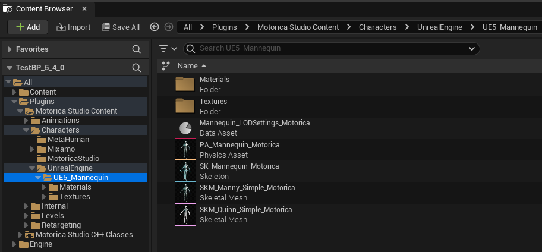

# Plugin Content

The plugin includes demo assets, such as IK Retargeters, that you can use. To view these assets, enable "Show Plugin Content" in the Content Browser settings.

Find the assets by navigating to `Plugins > Motorica Studio Content`.

!!! note
    The folder names may be different depending on which plugin and UE version you are using.

## Animations

This folder contains animations for Mo the Motorica character. These animations were generated with the Motorica Studio editor.

!!! note
    To retarget these animations to non-Motorica characters, read about how to use the supplied retargeting assets [here](retargeting.md).

## Characters

This folder contains the skeleton, mesh, textures, materials, and other assets for characters. These assets have [IK Rig](#retargeting) counterparts you can use for retargeting.

- **MetaHuman** - Used for retargeting to MetaHuman characters. Includes the default male body mesh only.
- **Mixamo** - Used for retargeting to Mixamo characters. Multiple characters are included with different body proportions.
- **MotoricaStudio** - This is the default character for which animations are generated in the plugin editor.
    - `SK_Motorica_Char_UE_v1` (recommended) - Introduced in v0.3.0, with updated blendshapes, root bone name, and root rotation.
    - `MoStudio_Character_Skeleton` (deprecated) - Used before v0.3.0. This skeleton has broken root motion in UE 5.4. This is kept for compatibility purposes and *will be removed in a future plugin release*.
- **UnrealEngine** - Used for retargeting to UE5 mannequin. Includes the default Manny and Quinn body meshes.

## Internal

Assets used internally by the plugin. You do not need to modify or use these assets.

## Levels

Demo levels that can be loaded in the Motorica Studio editor. "Prototype" is the default level loaded and can be changed in two ways:

- Modify the contents of `Level_Prototyping`
- Create your own level asset named `Level_Prototyping` and copy (or move) it to `Levels > Prototyping`. You will have to rename the original prototype level asset.

You can also load the current level you are working on:

1. Load the level asset in the main editor window.
2. Click the "globe icon" in the Motorica Studio editor.

## Retargeting

- **BP_RuntimeRTG_Base** - A spawnable `Actor Blueprint` that sets up runtime retargeting between the Motorica skeleton and other skeletons. This blueprint serves as a base which other blueprints can extend from.
- **LS_RuntimeRTG** - A `Level Sequence` asset demonstrating runtime retargeting from the Motorica skeleton to a set of other skeletons.

### MetaHuman

- **ABP_metahuman_Motorica** - `Animation Blueprint` used for runtime retargeting from the Motorica skeleton to the MetaHuman skeleton. It uses the `RTG_metahuman_Motorica` IK Retargeter asset.
- **BP_RuntimeRTG_metahuman_Motorica** - A spawnable `Actor Blueprint` that extends from `BP_RuntimeRTG_Base`. It sets up runtime retargeting from the Motorica skeleton to the MetaHuman skeleton using `ABP_metahuman_Motorica`.
- **IK_metahuman_Motorica** - `IK Rig` asset that configures the default MetaHuman skeleton for retargeting. This is identical to the default MetaHuman IK Rig *(confirmed UE 5.2)*.
- **RTG_metahuman_Motorica** - `IK Retargeter` asset that retargets from the `IK_Motorica_Char_UE_v1` IK Rig to the `IK_metahuman_Motorica` IK Rig. The MetaHuman retarget pose is edited to match the T-pose of the Motorica skeleton. IK retargeting is disabled.

### Mixamo

- **ABP_Mixamo_Mutant** - `Animation Blueprint` used for runtime retargeting from the Motorica skeleton to the Mixamo Mutant skeleton. It uses the `RTG_Mixamo_Mutant` IK Retargeter asset.
- **BP_RuntimeRTG_Mixamo_Mutant** - A spawnable `Actor Blueprint` that extends from `BP_RuntimeRTG_Base`. It sets up runtime retargeting from the Motorica skeleton to the Mixamo Mutant skeleton using `ABP_Mixamo_Mutant`.
- **IK_Mixamo_Mutant** - `IK Rig` asset that configures the Mixamo Mutant skeleton for retargeting. It contains bone chains for the spine, legs, arms, head and root, excluding fingers.
- **RTG_Mixamo_Mutant** - `IK Retargeter` asset that retargets from the `IK_Motorica_Char_UE_v1` IK Rig to the `IK_Mixamo_Mutant` IK Rig.

The assets above are for the *Mixamo Mutant* character. Other mixamo characters have similar assets.

### MotoricaStudio

- **ABP_Motorica_Char_UE_v1** - `Animation Blueprint` for runtime retargeting from the Motorica skeleton to itself. It uses the `RTG_Motorica_Char_UE_v1` IK Retargeter asset.
- **BP_RuntimeRTG_Motorica_Char_UE_v1** - A spawnable `Actor Blueprint` that extends from `BP_RuntimeRTG_Base`. It sets up runtime retargeting from the Motorica skeleton to itself using `ABP_Motorica_Char_UE_v1`.
- **IK_MoStudio** (deprecated) - `IK Rig` asset that configures the `MoStudio_Character_Skeleton` skeleton for retargeting.

    !!! warning
        `IK_MoStudio` uses an old Motorica skeleton that will be deleted in a future release. It is only kept for compatibility to retarget existing animations to the `SK_Motorica_Char_UE_v1` skeleton.

- **IK_Motorica_Char_UE_v1** (recommended) - `IK Rig` asset that configures the `SK_Motorica_Char_UE_v1` skeleton for retargeting.
- **RTG_MoStudio-to-v1** - `IK Retargeter` asset that retargets from the `IK_MoStudio` IK Rig to `IK_Motorica_Char_UE_v1` IK Rig.
- **RTG_Motorica_Char_UE_v1** - `IK Retargeter` asset that retargets from the `IK_Motorica_Char_UE_v1` IK Rig to itself.

!!! note
    IK Rig assets contain bone chains for the root, hips, spine, legs, arms, and head, except fingers. For compatibility, some bones like the root and shoulders have multiple chains. Find the ones that work best for you target skeleton. You can also copy the asset and customize the bone chains completely to improve retargeting to your character.

### UE5 Mannequin

- **ABP_Mannequin_Motorica** - `Animation Blueprint` used for runtime retargeting from the Motorica skeleton to the UE5 mannequin skeleton. It uses the `RTG_Mannequin_Motorica` IK Retargeter asset.
- **BP_RuntimeRTG_Mannequin_Motorica** - A spawnable `Actor Blueprint` that extends from `BP_RuntimeRTG_Base`. It sets up runtime retargeting from the Motorica skeleton to the UE5 mannequin skeleton using `ABP_Mannequin_Motorica`.
- **IK_Mannequin_Motorica** - `IK Rig` asset that configures the default UE5 mannequin skeleton for retargeting. This is identical to the default UE5 mannequin IK Rig *(confirmed in UE 5.2)*.
- **RTG_Mannequin_Motorica** - `IK Retargeter` asset that retargets from the `IK_Motorica_Char_UE_v1` IK Rig to the `IK_Mannequin_Motorica` IK Rig. The UE5 mannequin retarget pose is edited to match the T-pose of the Motorica skeleton. IK retargeting is disabled.
