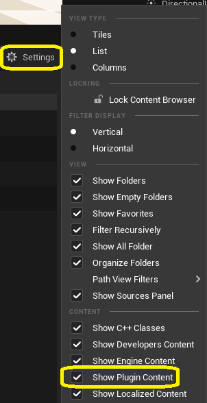

# Plugin Content

The plugin provides demo assets that you can use. For example, you can preview various pre-generated `Animation Sequence` assets or retarget them onto MetaHuman characters using the supplied `IK Rig` and `IK Retargeter` assets.

To view these assets, enable "Show Plugin Content" in the Content Browser settings.

And navigate to `Plugins > Motorica Studio Content`.

!!! note
    The folder names may be different depending on which plugin version you are using.

## Animations

This folder contains animations adapted to the Motorica character, generated using MoGen inside the Motorica Studio editor. You can preview and use these animations without having to open the Motorica Studio editor at all!

!!! note
    To retarget these animations to non-Motorica characters, read about how to use the supplied retargeting assets [here](retargeting.md).

## Characters

Contains assets (textures, skeleton, materials, etc.) of various characters that you can retarget MoGen-generated animations to.

- **MetaHuman** - (Target skeleton) Used for retargeting to MetaHuman characters. Includes the default male body mesh. (Other meshes like the face are not included to keep the plugin file small.)
- **Mixamo** - (Target skeleton) Used for retargeting to Mixamo characters. Multiple characters are included with different body proportions.
- **MotoricaStudio** - (Source skeleton) This is the default Motorica Studio character from which animations are retargeted. All MoGen-generated animations are applied to this character by default.
- **UnrealEngine** - (Target skeleton) Used for retargeting to UE5 mannequin. Includes the default male / female body meshes.

## Internal

Various assets used internally by the plugin. You do not need to modify or use these assets.

## Levels

Example levels that you can use inside the Motorica Studio editor.

The default "Prototype" level, which the Motorica Studio editor launches with, is included here. To force Motorica Studio editor to launch with a different level than the provided one, you can:

- Modify the contents of `Level_Prototyping`
- Create your own level asset named `Level_Prototyping` and copy (or move) it to `Levels > Prototyping`. You will have to rename the original prototype level asset.

The Motorica Studio editor can load other levels besides the prototype one. To load another level, you need to:

1. Load the level asset in the main editor window.
2. Click the "globe icon" in the Motorica Studio editor.

## Retargeting

- **BP_RuntimeRTG_Base** - A spawnable `Actor Blueprint` that sets up runtime retargeting between the Motorica skeleton and other skeletons. This blueprint serves as a base which other blueprints can extend from.
- **LS_RuntimeRTG** - A `Level Sequence` asset demonstrating runtime retargeting from the Motorica skeleton to a set of other skeletons.

### MetaHuman

- **ABP_metahuman_MoStudio** - `Animation Blueprint` used for runtime retargeting from the Motorica skeleton to the MetaHuman skeleton. It uses the `RTG_metahuman_MoStudio` IK Retargeter asset.
- **BP_RuntimeRTG_metahuman_MoStudio** - A spawnable `Actor Blueprint` that extends from `BP_RuntimeRTG_Base`. It sets up runtime retargeting from the Motorica skeleton to the MetaHuman skeleton using `ABP_metahuman_MoStudio`.
- **IK_metahuman_MoStudio** - `IK Rig` asset that configures the default MetaHuman skeleton for retargeting. This is identical to the default MetaHuman IK Rig *(confirmed UE 5.2)*.
- **RTG_metahuman_MoStudio** - `IK Retargeter` asset that retargets from the `IK_MoStudio` IK Rig to the `IK_metahuman_MoStudio` IK Rig. The MetaHuman retarget pose is edited to match the T-pose of the Motorica skeleton. IK retargeting is disabled.

### Mixamo

- **ABP_Mixamo_Mutant** - `Animation Blueprint` used for runtime retargeting from the Motorica skeleton to the Mixamo Mutant skeleton. It uses the `RTG_Mixamo_Mutant` IK Retargeter asset.
- **BP_RuntimeRTG_Mixamo_Mutant** - A spawnable `Actor Blueprint` that extends from `BP_RuntimeRTG_Base`. It sets up runtime retargeting from the Motorica skeleton to the Mixamo Mutant skeleton using `ABP_Mixamo_Mutant`.
- **IK_Mixamo_Mutant** - `IK Rig` asset that configures the Mixamo Mutant skeleton for retargeting. It contains bone chains for the spine, legs, arms, head and root, excluding fingers.
- **RTG_Mixamo_Mutant** - `IK Retargeter` asset that retargets from the `IK_MoStudio` IK Rig to the `IK_Mixamo_Mutant` IK Rig.

The assets above are for the *Mixamo Mutant* character. Other mixamo characters have similar assets.

### MotoricaStudio

- **ABP_MoStudio** - `Animation Blueprint` used for runtime retargeting from the Motorica skeleton to itself. It uses the `RTG_MoStudio` IK Retargeter asset.
- **BP_RuntimeRTG_MoStudio** - A spawnable `Actor Blueprint` that extends from `BP_RuntimeRTG_Base`. It sets up runtime retargeting from the Motorica skeleton to itself using `ABP_MoStudio`.
- **IK_MoStudio** - `IK Rig` asset that configures the Motorica skeleton for retargeting. It contains bone chains for the root, hips, spine, legs, arms, and head, except fingers. For compatibility, some bones like the root and shoulders have multiple chains. Find the ones that work best for you target skeleton. You can also copy the asset and customize the bone chains completely to improve retargeting to your character. Most `IK Retargeter` assets in the plugin use this IK Rig as the *retargeting source*.
- **IK_MoStudio_legacy** - This is the legacy `IK Rig` asset that was provided in *Motorica Studio v0.1.0* called `IK_Motorica`. You should use `IK_MoStudio` from now on. If you are using the old `IK_Motorica` IK Rig, update your references to point to `IK_MoStudio_legacy`.
- **RTG_MoStudio** - `IK Retargeter` asset that retargets from the `IK_MoStudio` IK Rig to itself. This is mainly used for debugging purposes.

### UE5 Mannequin

- **ABP_Mannequin_MoStudio** - `Animation Blueprint` used for runtime retargeting from the Motorica skeleton to the UE5 mannequin skeleton. It uses the `RTG_Mannequin_MoStudio` IK Retargeter asset.
- **BP_RuntimeRTG_Mannequin_MoStudio** - A spawnable `Actor Blueprint` that extends from `BP_RuntimeRTG_Base`. It sets up runtime retargeting from the Motorica skeleton to the UE5 mannequin skeleton using `ABP_Mannequin_MoStudio`.
- **IK_Mannequin_MoStudio** - `IK Rig` asset that configures the default UE5 mannequin skeleton for retargeting. This is identical to the default UE5 mannequin IK Rig *(confirmed in UE 5.2)*.
- **RTG_Mannequin_MoStudio** - `IK Retargeter` asset that retargets from the `IK_MoStudio` IK Rig to the `IK_Mannequin_MoStudio` IK Rig. The UE5 mannequin retarget pose is edited to match the T-pose of the Motorica skeleton. IK retargeting is disabled.
