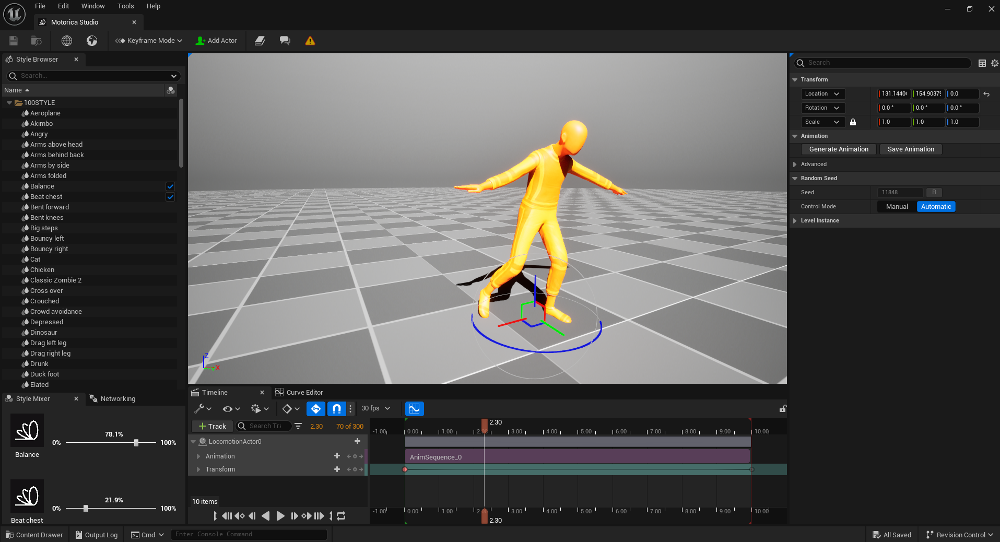
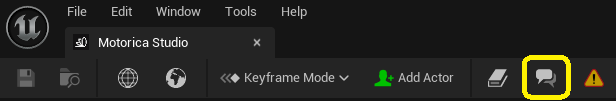

# Introduction
> [!NOTE]
> Are you looking for our web-based **Style Viewer**, use [this link](http://mogen.motorica.ai).

## About

Motorica Studio is a software program that integrates Motorica's animation generation and editing tools inside Unreal Engine 5. The UE integration is in the form of a precompiled plugin added to your UE project.
 

## Discord Community and Help

We have set up a [Discord](https://discord.com/invite/KWRqNzcjYA) server with the goal of growing a community of enthusiastic individuals that wish to help each other out. This is a place where you can **ask questions** about animation and generative AI, **share feedback** with the Motorica team, or **report issues** that you experience with Motorica Studio.

The following button in Motorica Studio will quickly take you to our Discord server:

## Next steps

Get started with Motorica Studio by first setting up the plugin:

- [Register](installing.md#register-at-motorica) at Motorica
- [Download](installing.md#download-motorica-studio) Motorica Studio
- [Install](installing.md#install-guides) Motorica Studio
- [Configure](installing.md#configure-motorica-studio) Motorica Studio
