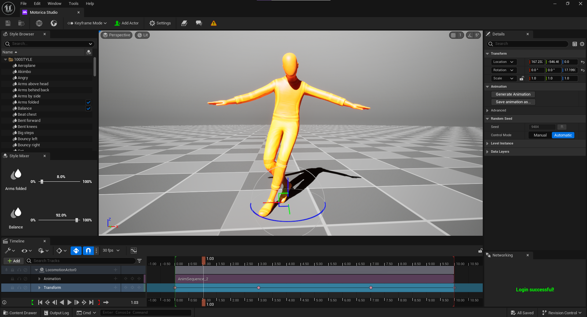

# Introduction

## About

Motorica Studio is an Unreal Engine 5+ plugin that integrates Motorica's animation generation and editing tools inside Unreal Engine. The plugin is precompiled and added to your UE project or folder.
 

## Discord Community and Help

We have a growing [Discord](https://discord.com/invite/KWRqNzcjYA) community of enthusiastic members (over 3k!) with whom you can chat. The Motorica team is also present, so you can contact them directly if you want to:

- ask **questions**
- share **feedback**
- report **issues**

This button in Motorica Studio will take you there:

## Next steps

Get started with Motorica Studio by first setting up the plugin:

- [Register](installing.md#register-at-motorica) at Motorica
- [Download](installing.md#download-motorica-studio) Motorica Studio
- [Install](installing.md#install-guides) Motorica Studio

Other Guides:

- [Maya quickstart guide](https://static1.squarespace.com/static/63650e2ece9c2f59c302558c/t/642c26e43c05c96c26046ebe/1680615141379/Quickstart_guide_maya.pdf)
- [Blender quickstart guide](https://static1.squarespace.com/static/63650e2ece9c2f59c302558c/t/642c2709c9ab035489441a8c/1680615178980/Quickstart_guide_blender.pdf)
- [Houdini tutorial](https://youtu.be/m5ZcMsATAfg)
- [Maya tutorial](https://vimeo.com/831841460)
