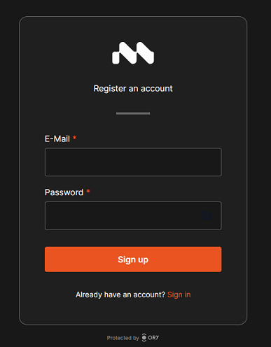
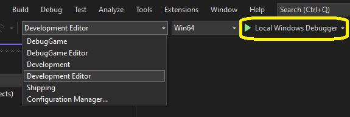
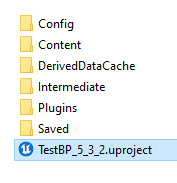
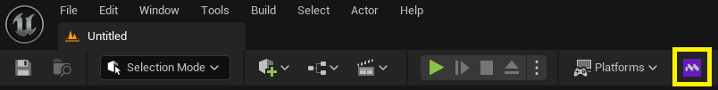
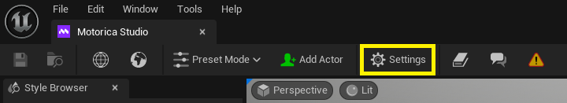
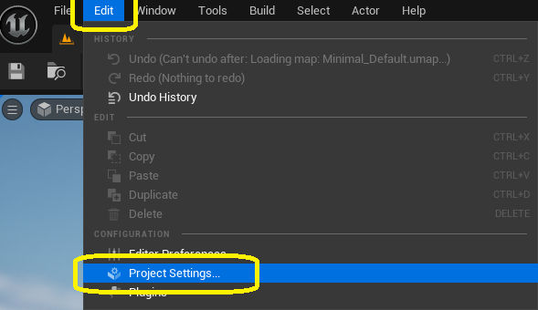
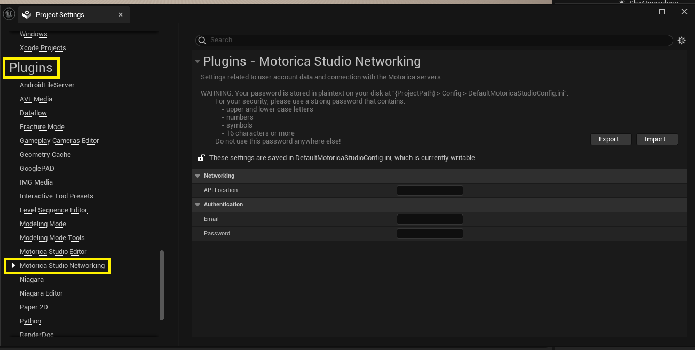
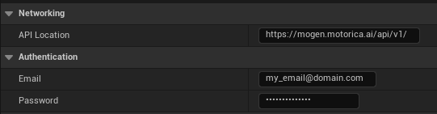
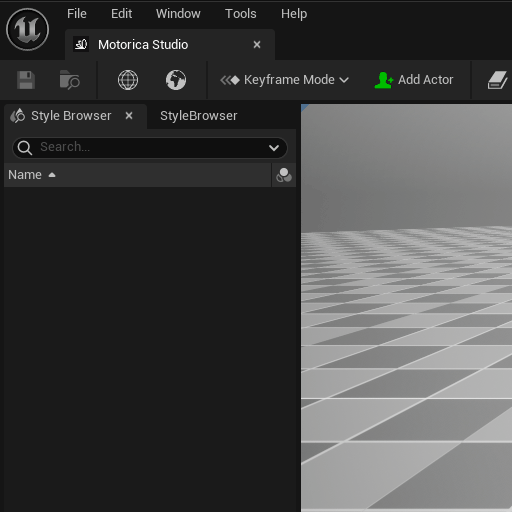

# Install Motorica Studio

Motorica Studio currently does not follow a strict release cycle. Stay updated by joining our [Discord](https://discord.com/invite/KWRqNzcjYA) server for release announcements and check the latest changes in the [patch notes](../changelog.md).

## System Requirements

Find a list of supported Unreal Engine versions and platform in the [Downloads](../downloads.md) page.

## Register

To use the plugin, you need to register a legacy Motorica account using our old registration system at this URL: [https://auth.motorica.ai/ui/registration](https://auth.motorica.ai/ui/registration)

!!! warning
    A legacy account only grants access to the Motorica UE plugin and our legacy systems. To access our latest features in our beta web app, you will need to register a standard account on our beta web platform: [https://app.beta.motorica.ai/auth/sign-in](https://app.beta.motorica.ai/auth/sign-in)
    
    A legacy account is different from the standard account. These two accounts are not compatible with each other, cannot be transferred, and must be registered individually.

!!! tip
    For your security:

    - Use a combination of **numbers**, **symbols**, and **upper and lower case letters** in your password.
    - Use a password that is **16 characters long** or more.
    - Use a **unique** password (i.e. you have not used the password anywhere else).

## Download

Go to the [Downloads](../downloads.md) page.

## Install
### Install for All Projects

1. Extract the downloaded `.zip` to Unreal Engine's installation folder.
    - The default Windows location is `C:\Program Files\Epic Games\UE_[version]\Engine`
2. Load any UE project
      - For C++ projects, build and run using your IDE (e.g. Visual Studio):

        

      - For BP projects, use the project executable:        

        

3. Enable the plugin via `Edit > Plugins > Installed | Animation > Motorica Studio`
4. Restart the UE editor
5. This button will appear after successful installation

    

6. !!! warning
    For plugin versions **0.3.0 and below**, you will need to [configure the plugin](#configure-030-and-below).

!!! note
    Each UE project has its own list of enabled plugins and plugin settings. Therefore, you must enable and configure Motorica Studio *separately* for each project.

### Install for a Single Project

1. Extract the downloaded `.zip` to your project's root folder
2. Load your UE project
      - For C++ projects, build and run using your IDE (e.g. Visual Studio):

        

      - For BP projects, use the project executable:

        

3. Enable the plugin via `Edit > Plugins > Installed | Animation > Motorica Studio`
4. Restart the UE editor
5. This button will appear after successful installation

    

6. !!! warning
    For plugin versions **0.3.0 and below**, you will need to [configure the plugin](#configure-030-and-below).

## Configure (0.3.0 and below)

??? info "Instructions (click to show)"

    **Open plugin settings**

    Open the Motorica Studio editor and press the "Settings" button in the toolbar:

    

    Alternatively, navigate to `Edit > Project Settings > Plugins > Motorica Studio Networking`.

    
    

    **Configuration values**

    - **API Location** - Write `https://mogen.motorica.ai/api/v1/`.
    - **Email** - Write your Motorica account email.
    - **Password** - Write your Motorica account password.

        !!! warning
            **The password is stored in plain-text in the plugin config file** at `YourProjectRoot > Config > DefaultMotoricaStudioConfig.ini`.
            
            Make sure to use a **unique password**!

            Make sure to **delete the config file when copying your project**!

    

    **Verify the Configuration**

    Verify that you entered your information correctly by logging in from the Motorica Studio Editor:

    1. Open the *Motorica Studio editor*.

        

    2. Login from the *Networking* panel. 

        

        If you see **"Login successful!"**, then your configuration was correct.

        If you see **"Login failed!"**, your configuration might be wrong. Please double-check the information in the plugin settings and try again. If the issue persists, reach out on [Discord](https://discord.com/invite/KWRqNzcjYA).
