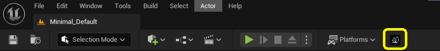

# Install Motorica Studio

Motorica Studio currently does not follow a strict release cycle. You can keep up to date with the latest changes through the [patch notes](../patch-notes/index.md) and by joining our [Discord](https://discord.com/invite/KWRqNzcjYA) server for release announcements.

## System Requirements

Motorica Studio is available for download only on *Windows*. If you think that Motorica Studio should be available on other platforms (Linux, macOS), please let us know on [Discord](https://discord.com/invite/KWRqNzcjYA).

Make sure that you have installed an Unreal Engine version that is supported by Motorica Studio. A list of supported UE versions is available [here](../downloads.md).

## Register at Motorica

To use Motorica Studio, you will first need to register an account at [Motorica](https://mogen.motorica.ai/). For your security, please keep the following in mind when creating your password:

- Use a combination of **numbers**, **symbols**, and **upper and lower case letters**.
- Password length should be **16 characters or more**.
- Your password is **unique** (used only for Motorica and nowhere else).

## Download Motorica Studio

Motorica Studio offers compiled binaries for different UE versions for both *blueprint* and *C++* projects. Choose and download a version of Motorica Studio from the [Downloads](../downloads.md) page.

## Install Guides
### Install for All Projects

1. Extract the downloaded `.zip` to Unreal Engine's installation folder.
    - The default Windows location is `C:\Program Files\Epic Games\UE_[version]\Engine`
2. Load any UE project
      - For C++ projects, build and run using your IDE (e.g. Visual Studio):

        

      - For BP projects, use the project executable:        

        

3. Enable the plugin via `Edit > Plugins > Installed | Animation > Motorica Studio`
4. Restart the UE editor
5. [Configure Motorica Studio](#configure-motorica-studio)

Note that each UE project has its own set of enabled plugins and plugin settings. As such, you will need to enable and configure Motorica Studio in each project *separately*.

### Install for a Single Project

1. Extract the downloaded `.zip` to your project's root folder
2. Load your UE project
      - For C++ projects, build and run using your IDE (e.g. Visual Studio):

        

      - For BP projects, use the project executable:

        

3. Enable the plugin via `Edit > Plugins > Installed | Animation > Motorica Studio`
4. Restart the UE editor
5. [Configure Motorica Studio](#configure-motorica-studio)

## Configure Motorica Studio

At this stage, you should have enabled Motorica Studio in your project. You will know this was successful if you have the following button in the level editor toolbar:

### Open Plugin Settings

Settings are opened at `Edit > Project Settings > Plugins > Motorica Studio`.

### Configuration Values

- **API Location** - Write `https://mogen.motorica.ai/api/v1/` without any spaces.
- **Email** - Enter the email for your Motorica account. (Register on the [Motorica website](https://www.motorica.ai/)).
- **Password** - Enter the password for your Motorica account. (Register on the [Motorica website](https://www.motorica.ai/)).
    - *Warning: The password is stored in plain-text in the plugin config file at `YourProjectRoot > Config > DefaultMotoricaStudioConfig.ini`. You are advised to use a unique password that you do not use anywhere else.*

### Verify the Configuration

Verify that you entered your information correctly by logging in from the Motorica Studio Editor:

1. Open the *Motorica Studio editor*.

    

2. Login from the *Networking* panel. 

    

    If you see **"Login successful!"**, then your configuration was correct.

    If you see **"Login failed!"**, your configuration might be wrong. Please double-check the information in the plugin settings and try again. If the issue persists, reach out to us on [Discord](https://discord.com/invite/KWRqNzcjYA).
