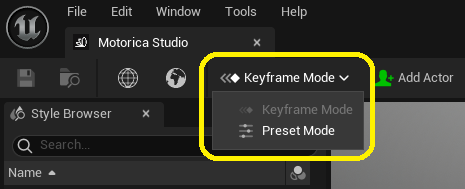
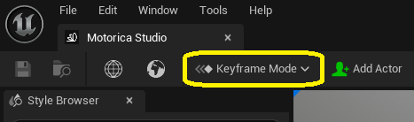
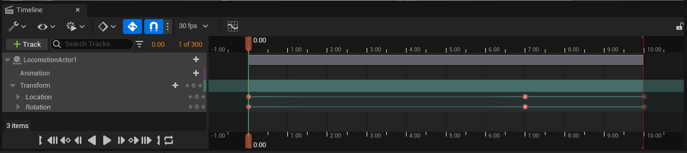
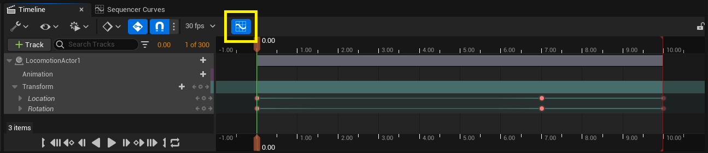
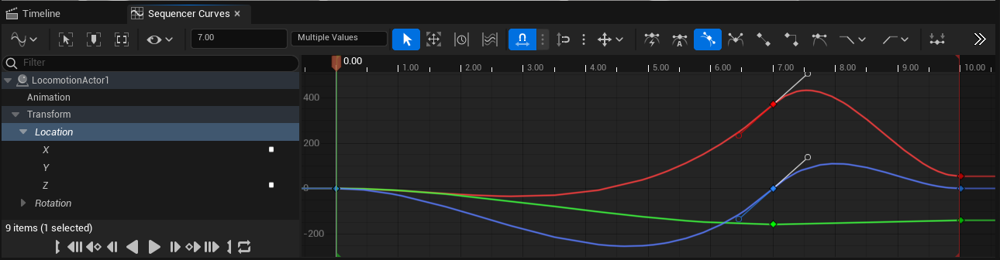
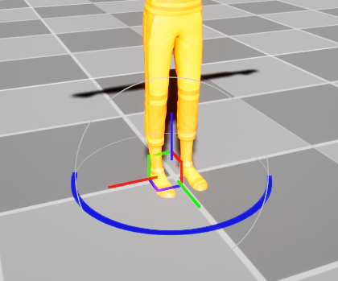
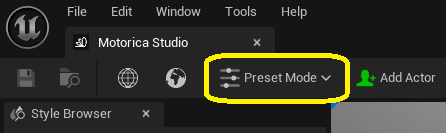
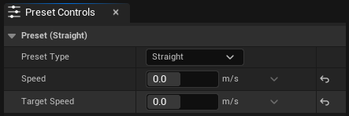
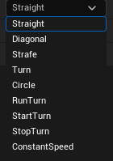

# Editor Modes
The Motorica Studio Editor organizes its various features into so-called **editor modes**. The idea of editor modes is to help structure your creative workflow by exposing only the necessary tools for a given task at a time.

Locate this dropdown in the Motorica Studio Editor to switch between editor modes:

## Keyframe Mode

This mode lets you keyframe custom paths for which you can generate character animations. This is especially useful if you have [loaded a custom level](ui-motorica-studio-editor.md#level-switchers) and want your character to move around objects in your scene.

### **Timeline**

Used to keyframe the location and rotation of your character over time. This is essentially a slightly modified version of the default UE *Sequencer*.

!!! warning
    Do not add new *Animation* or *Transform* tracks to existing Locomotion Actors. This could result in unexpected behavior.

### **Curve Editor**

Used for fine-grained control over the value and curve (interpolation) of your keyframes. This is default functionality of the UE *Sequencer*.

### **Viewport Gizmo**

Used this to move your character around the scene.

!!! note
    Motorica Studio Editor uses a different gizmo style than the default UE one for various technical reasons. The gizmo is experimental and its look-and-feel is not final. If you experience any difficulties with the gizmo interaction, please let us know!

!!! bug
    When rotating the gizmo beyond `-180` and `180`, the *Yaw* / *Z-axis* value will wrap-around by 180 degrees. This will cause your animation to make a very fast rotation which you msot likely do not want.
    
    Correct the value manually via the *Details* panel, the *Timeline* track keyframe value, or the *Curve Editor* UI.

## Preset Mode

This mode lets you generate animations for parameterized preset paths, without the need for manual keyframing. This is in contrast to *Keyframe* mode, in which you create the paths yourself by moving the character in the viewport and keyframing its location and rotation in the *Timeline*.

In *Preset Mode*, actors are not affected by location and rotation keyframes in the *Timeline*, because the corresponding *Transform* tracks are disabled. Switching to *Keyframe Mode* will re-enable them.

!!! warning
    Do not “Lock" or “Mute” the *Transform* tracks of any locomotion actor in the *Timeline*. The plugin automatically handles locking, unlocking, muting, and unmuting the tracks when switching between editor modes.
    
    Locking or muting the *Transform* tracks yourself can cause issues with generating and previewing the animations.

### Presets
*Preset Mode* exposes one primary tool: the **Preset Controls** panel. The panel has a "Preset Type" dropdown which contains a list of parameterized presets you can choose from. Clicking on any preset will reveal its parameters below the dropdown.

Below is a list of the current presets and what their parameters mean.

!!! note
    Negative values for `Speed` and `Target Speed` variables will reverse the direction of travel.

- **Straight** - A character traveling in a straight line along the initial facing direction. It starts at `Speed` m/s and transitions to `Target Speed` m/s at the end
- **Diagonal** - A character traveling diagonally at 45°. It starts at `Speed` m/s and transitions to `Target Speed` m/s at the end.

    !!! bug
        Currently, `Angle` does not affect the direction angle precisely - it only inverts the direction of diagonal travel.

- **Strafe** - A character traveling sideways (strafing). It starts at `Speed` m/s and transitions to `Target Speed` m/s at the end.
- **Turn** - A character turning in-place by `Angle` degrees, without traveling in any direction.
- **Circle** - A character walking/running in a circle with a speed of `Speed` m/s and turn angle of `Turn Angle` degrees per second.
- **RunTurn** - A character running forward at `Speed` m/s, and turning by `Angle` degrees midway along its path.
- **StartTurn** - A character standing still before it begins traveling at `Speed` m/s in a direction of `Angle` degrees away from its initial facing direction.
- **StopTurn** - A character traveling forward at `Speed` m/s before coming to a full stop and facing a direction of `Angle` degrees away from its initial facing direction.
- **Constant Speed** - A character traveling in a global direction specified by a `Forward` velocity vector (m/s) and a `Sideways` velocity vector (m/s). `Forward` is looking along Y+ and `Sideways` is looking along X+. The character can also travel along a circular path at `Rotation` degrees per second. A larger radius can be achieved with a smaller `Rotation` or larger `Forward` / `Sideways` values.
