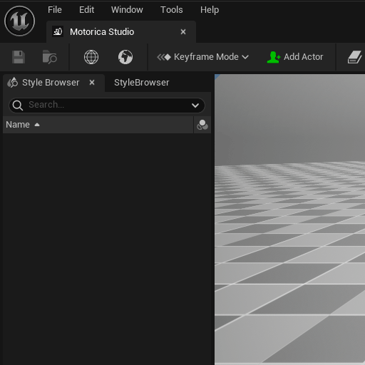
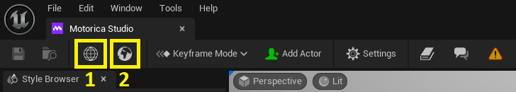
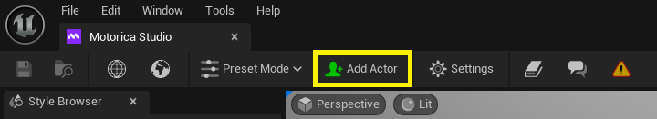

# Editor User Interface

The *Motorica Studio Editor* window is the place which houses all the main tools that Motorica Studio offers. This is where you can generate animations for your characters.

!!! note
    When opening the editor for the first time, some tabs might be floating instead of being docked in the editor. You can copy the layout above or find a new one that suits your workflow the best.

## Launch the Editor

To open the Motorica Studio Editor, click the button with Motorica's logo in the Level Editor toolbar:

You can also open the window via `Window > Motorica Editor` from the main window:

## Login to Motorica

Motorica Studio requires internet connection to work properly. Make sure that you have [configured Motorica Studio](installing.md#configure-motorica-studio) correctly and login via the *Networking* panel:

## Toolbar

!!! note
    The "Save" and "Browse" buttons on the left are always disabled / greyed out. This is not a bug, but a choice made due to technical limitations of the default Unreal Engine asset editor toolbar.

### Level Switchers

There are two buttons that let you switch the current level shown in the Motorica Studio Editor viewport.

1. Clicking the "Wireframe Globe" button loads the default "Prototype" level that the Motorica Studio Editor starts with.
    

2. Clicking the "Solid Globe" button loads the level that is currently opened in the main editor window. 
    

    

    Use this feature to more easily generate animations that fit within your scene.

    !!! note
        Because the plugin does not support generating animations for retargeted characters, you should keep in mind that the above contextualization will suffer from different bone lengths between the source and target skeletons, particularly the hip height.

    !!! warning
        World Partition / Streaming Levels are not supported by the editor. Loading such a level may cause the plugin editor viewport to display gray or black. In that case, you can either use the default “Prototype” level by pressing the Wireframe Globe button, or by loading a non-streaming level.

### Editor Mode Selector

This selector switches the current *editor mode* of the Motorica Studio Editor. Read more about editor modes [on this page](./ui-editor-modes.md).

### Add Actor

The "Add Actor" button in the Motorica Studio Editor toolbar spawns a character in the viewport scene. This character is commonly refered to as a *Locomotion Actor*.

!!! warning
    When adding an actor to the scene, a track will spawn in the [*Timeline*](ui-editor-modes.md#timeline). **Do not rename this track!**

!!! bug
    When adding an actor for the first time using Motorica Studio, the UE editor will freeze while the mesh loads.

    

    Please wait for the mesh to load and **do not close Unreal Engine**. This can take between 15 seconds and 3 minutes depending on your hardware.

You can spawn more than one Locomotion Actor in the scene:

!!! note
    Currently, animations can be generated only for Locomotion Actors. If you wish to apply the animations to other characters, you will need to [retarget](retargeting.md) the animations.

### Navigation Buttons

The end of the toolbar hosts several buttons that help you navigate to several useful resources:

1. **Motorica Studio Documentation** - A place where you can learn how to use and leverage Motorica Studio's tools Essentially, this is what you are reading currently.
2. **Community Page** - A place where you can learn more about Motorica's community and how to join it. At the moment, we have a [Discord](https://discord.com/invite/KWRqNzcjYA) server with over 1.5k members!
3. **Bug Report Page** - A place where you can report bugs, share feedback, and request new features.

## Tabs

!!! TODO
    This section is not yet fully documented. However, tabs specific to editor modes [are documented](ui-editor-modes.md).

### Networking Panel

The *Networking* panel is only used for logging in to Motorica. That's it!

### Style Browser

TODO

### Style Mixer

TODO

### Viewport

TODO
