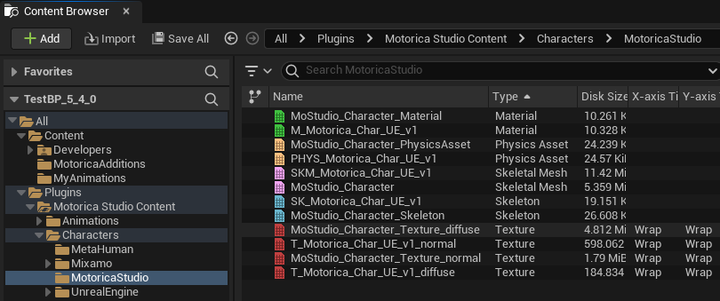

# Retarget to v0.3.0 skeleton

This is a guide to retarget Animation Assets from the old `MoStudio_Character_Skeleton` skeleton to the new `SK_Motorica_Char_UE_v1` one. You would need this if you generated animations using Motorica Studio v0.2.0 and below.

!!! note
    This guide is written for UE 5.4, but the process is similar in earlier versions.

## Introduction

With UE 5.4, Epic introduced code changes that broke root motion and motion matching on the default Motorica skeleton `MoStudio_Character_Skeleton`. Motorica Studio v0.3.0 introduces new skeleton assets to address this issue.

The new `SK_Motorica_Char_UE_v1` skeleton is used by the plugin editor to generate animations. You are recommended to use this one. **The old skeleton `MoStudio_Character_Skeleton` is deprecated and will be removed in the future**.

## Retarget Steps

<!-- <iframe src="../assets/videos/0-3-0/retarget-to-v3.mp4" ></iframe> -->

1. Select your animations
2. Right-click and press "Retarget Animations"
3. Set `Target > Target Skeletal Mesh` to `SKM_Motorica_Char_UE_v1`
4. Disable `Retargeter > Auto Generate Retargeter`
5. Set `Retargeter > Retarget Asset` to `RTG_MoStudio-to-v1`
6. Select the animations to retarget from the list
7. Click "Export Animations"
8. Pick a save path

    !!! tip
        Save in a different location from the source animations to retain their original names.

9.  (Optional) Add a suffix
10. Press "Export"
11. Press "Export" again
12. Save your animations
13. (Optional) Delete the previous animations
