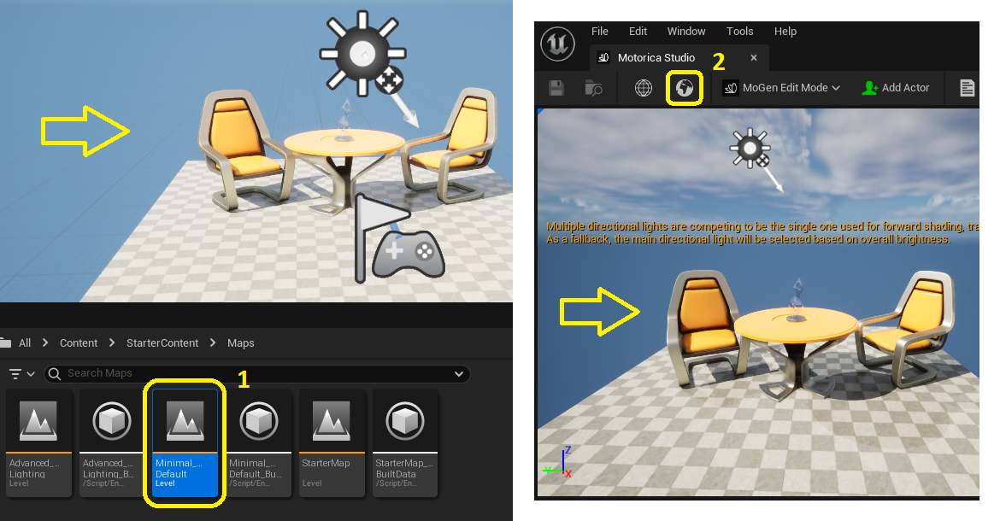

# Included assets
The plugin comes with premade assets that you can work with. For example, you can preview example MoGen-generated animations or retarget them onto MetaHuman characters using the supplied IK Rig and IK Retargeter asset.

To view these assets, enable "Show Plugin Content" in the Content Browser settings.

And navigate to `Plugins > Motorica Studio > Content`.

Note: The folder names may differ depending on the plugin version you are using.

## Animations

This folder contains animations adapted to the Motorica character, generated using MoGen inside the Motorica Studio editor. You can preview and use these animations without having to open the Motorica Studio editor at all!

If you wish to retarget these animations to non-Motorica characters, read about the assets inside the "Retargeting" folder further below.

## Characters

Contains assets (textures, skeleton, materials, etc.) of various characters that you can retarget MoGen-generated animations to.

- **MetaHuman** - Added for support of MetaHuman retargeting. Includes the default male / female body meshes. When retargeting, this character would be the retarget *Target*.
- **Mixamo** - Use these to preview how animations are affected when applied to different body proportions. When retargeting, this character would be the retarget *Target*.
- **MotoricaStudio** - This is the default character used throughout the plugin. All MoGen-generated animations are applied to the skeleton of this character by default. When retargeting, this character would be the retarget *Source*.

## Internal

Various assets used internally by the plugin. You do not need to modify or use these assets.

## Levels

Example levels that you can use inside the Motorica Studio editor.

The default "Prototype" level, which the Motorica Studio editor launches with, is included here. To force Motorica Studio editor to launch with a different level than the provided one, you can:
- Modify the contents of `Level_Prototyping`
- Create your own level asset named `Level_Prototyping` and copy (or move) it to `Levels > Prototyping`. You will have to rename the original prototype level asset.

The Motorica Studio editor can load other levels besides the prototype one. To load another level, you need to:
1. Load the asset in the main editor window by double-clicking it.
2. Click the "globe icon" in the Motorica Studio editor.

## Retargeting
For a walkthrough on how to use the assets below to retarget Motorica animations, please refer to [Retargeting](/retargeting) docs page.

A collection of assets that can be used to retarget animations from the Motorica skeleton to other skeletons. The folder contains the following assets:

- **ABP_Switchable** - `Animation Blueprint` used for runtime retargeting from the Motorica skeleton to other skeletons. It is possible to switch the target skeleton via a variable named `IKRetargeterAsset`.
- **BP_RuntimeRTG_Base** - A spawnable `Actor Blueprint` that sets up runtime retargeting between the Motorica skeleton and other skeletons. This blueprint serves as a base which other blueprints extend.
- **BP_RuntimeRTG_Switchable** - A spawnable `Actor Blueprint` that sets up runtime retargeting between the Motorica skeleton and other skeletons. This blueprint allows the switching of the target skeleton via the functions `SetIKRetargeterAsset` and `SetTargetMesh`.
- **LS_RuntimeRTG** - A `Level Sequence` asset demonstrating runtime retargeting from the Motorica skeleton to a set of Mixamo skeletons and MetaHuman skeletons.
- **LS_RuntimeRTG_Switchable** - A `Level Sequence` asset demonstrating runtime retargeting from the Motorica skeleton to a set of Mixamo skeletons of various sizes. The skeletons are switched by a Sequencer track during while the sequence plays.

### MetaHuman

- **ABP_MetaHuman_full** - `Animation Blueprint` used for runtime retargeting from the "minimal" Motorica skeleton to the "full" MetaHuman skeleton. A similar blueprint exists for all other Mixamo characters. 
- **ABP_MetaHuman_minimal** - `Animation Blueprint` used for runtime retargeting from the "minimal" Motorica skeleton to the "minimal" MetaHuman skeleton. A similar blueprint exists for all other Mixamo characters. 
- **BP_RuntimeRTG_MetaHuman_full** - A spawnable `Actor Blueprint` that extends from `BP_RuntimeRTG_Base`. It sets up runtime retargeting between the "minimal" Motorica skeleton and the "full" MetaHuman skeleton.
- **BP_RuntimeRTG_MetaHuman_minimal** - A spawnable `Actor Blueprint` that extends from `BP_RuntimeRTG_Base`. It sets up runtime retargeting between the "minimal" Motorica skeleton and the "minimal" MetaHuman skeleton.
- **IK_MetaHuman_full** - `IK Rig` asset that sets up retargeting for the default MetaHuman skeleton. The asset contains bone chains for arms, legs, spine, head, root, and fingers.
- **IK_MetaHuman_minimal** - `IK Rig` asset that sets up retargeting for the default MetaHuman skeleton. The asset contains bone chains for arms, legs, spine, head, root, excluding fingers.
- **RTG_MetaHuman_full_MoStudio_minimal** - `IK Retargeter` asset that sets up retargeting from the Motorica skeleton to the MetaHuman skeleton. Bone chains from the "minimal" Motorica character IK Rig are mapped to bone chains from the "full" MetaHuman IK Rig.
- **RTG_MetaHuman_minimal_MoStudio_minimal** - `IK Retargeter` asset that sets up retargeting from the Motorica skeleton to the MetaHuman skeleton. Bone chains from the "minimal" Motorica character IK Rig are mapped to bone chains from the "minimal" MetaHuman IK Rig.

### Mixamo

These assets correspond to the Mixamo Mutant character. Other Mixamo characters also have similar assets:

- **ABP_Mixamo_Mutant** - `Animation Blueprint` used for runtime retargeting from the Motorica skeleton to the Mixamo Mutant skeleton.
- **BP_RuntimeRTG_Mixamo_Mutant** - A spawnable `Actor Blueprint` that extends from `BP_RuntimeRTG_Base`. It sets up runtime retargeting between the Motorica skeleton and the Mixamo Mutant skeleton.
- **IK_Mixamo_Mutant** - `IK Rig` asset that sets up retargeting for the Mixamo Mutant skeleton. It contains a minimal bone map composed of the spine, arms, legs, head, and root of the character.
- **RTG_Mixamo_Mutant** - `IK Retargeter` asset that sets up retargeting from the Motorica skeleton to the Mixamo Mutant skeleton. Bone chains from the Motorica character IK Rig are mapped to bone chains from the Mixamo Mutant IK Rig.

### MotoricaStudio

- **IK_MoStudio_legacy** - This is the legacy `IK Rig` asset that was provided in Motorica Studio v0.1.0, and is included for compatibility reasons here. The recommendation now is to use `IK_MoStudio_minimal` instead. If you are using the old `IK_Motorica`, you should update the references to this asset.
- **IK_MoStudio_minimal** - `IK Rig` asset that sets up skeleton retargeting for the Motorica skeleton. This setup is minimal as it excludes individual bones and finger bones. Only the spine, legs, arms, head, and root have bone chains. Use this asset inside an `IK Retargeter` asset and set it as the retargeting "source" to retarget from the Motorica skeleton to other skeletons.
- **RTG_MoStudio_minimal** - `IK Retargeter` asset that retargets from the Motorica skeleton to itself. This is mainly used for debugging purposes.