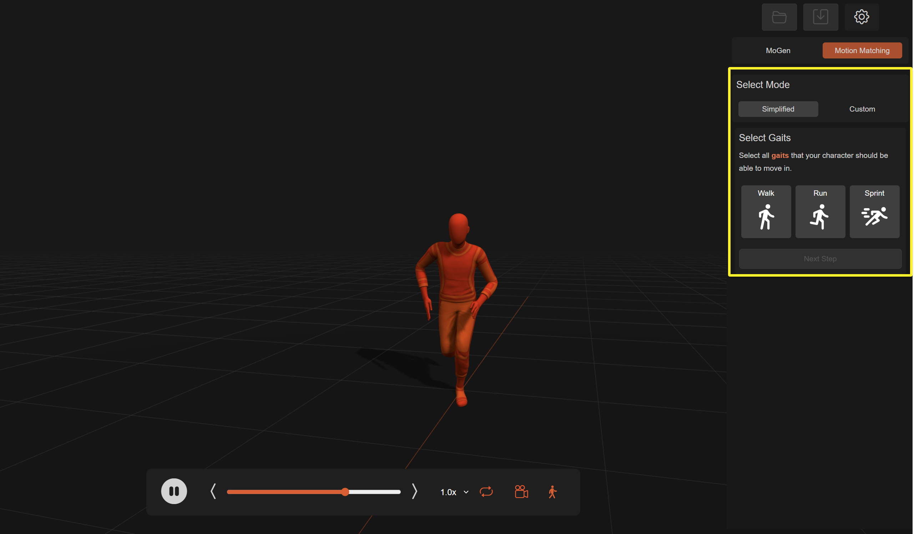
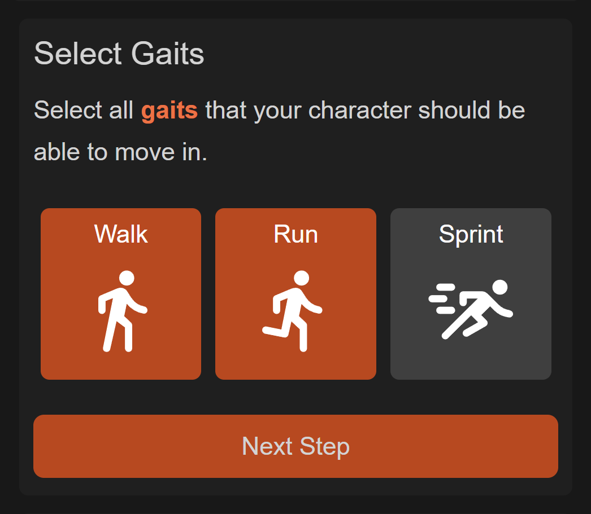
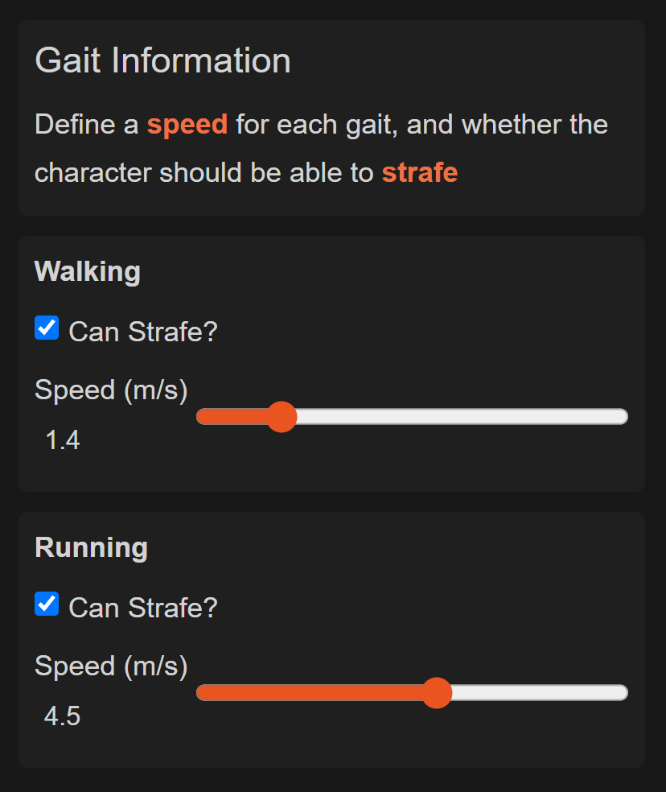
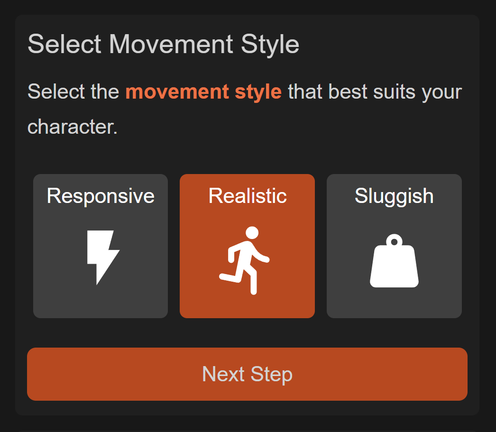
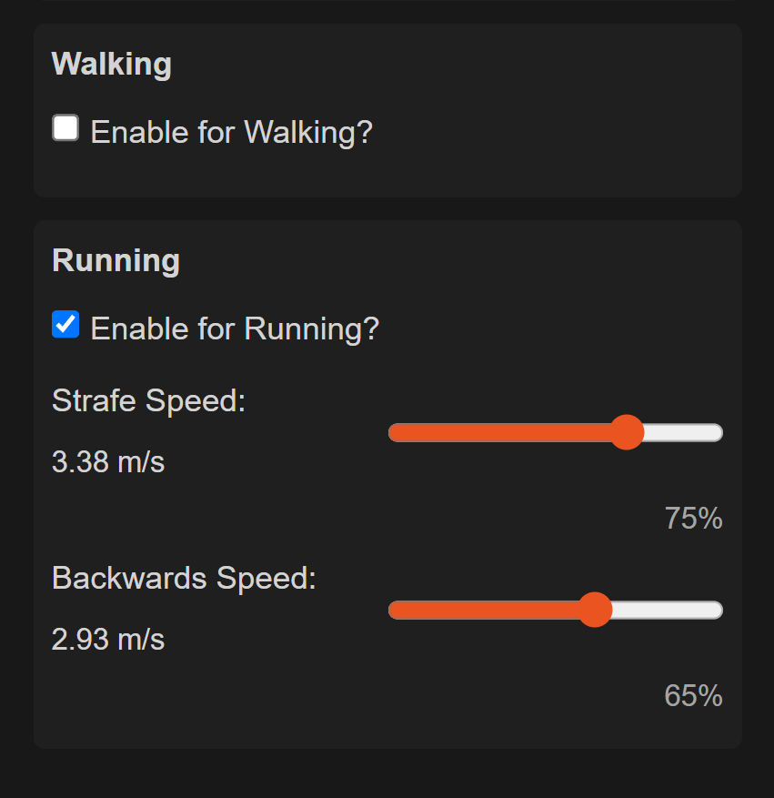
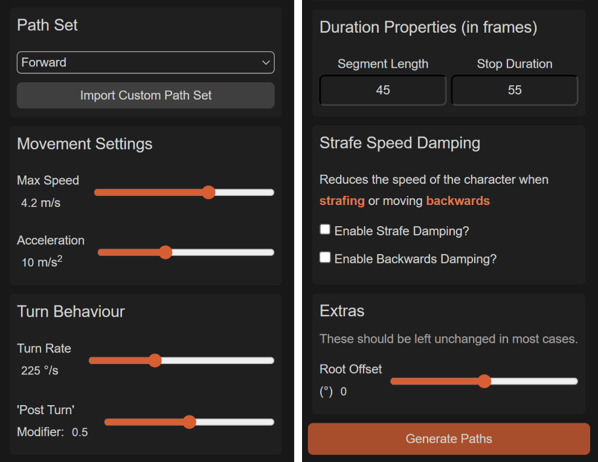
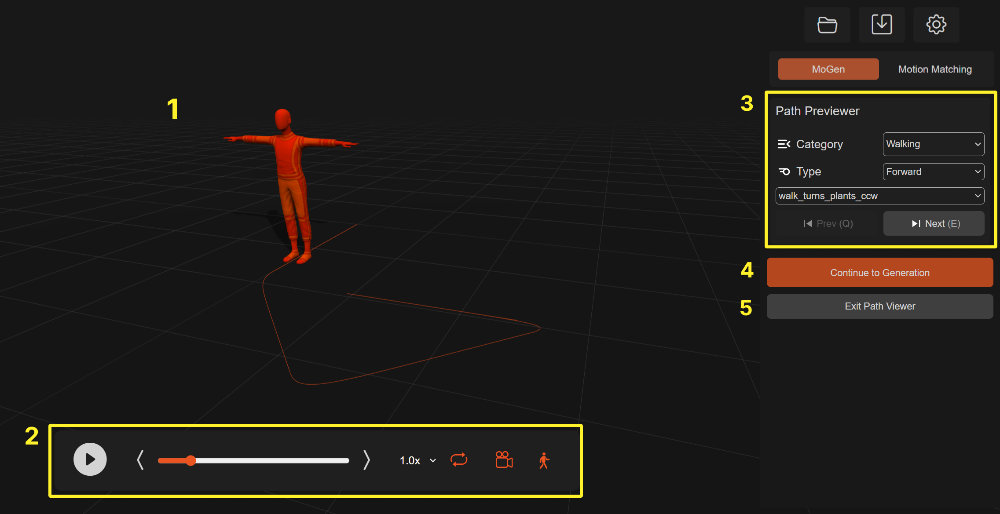
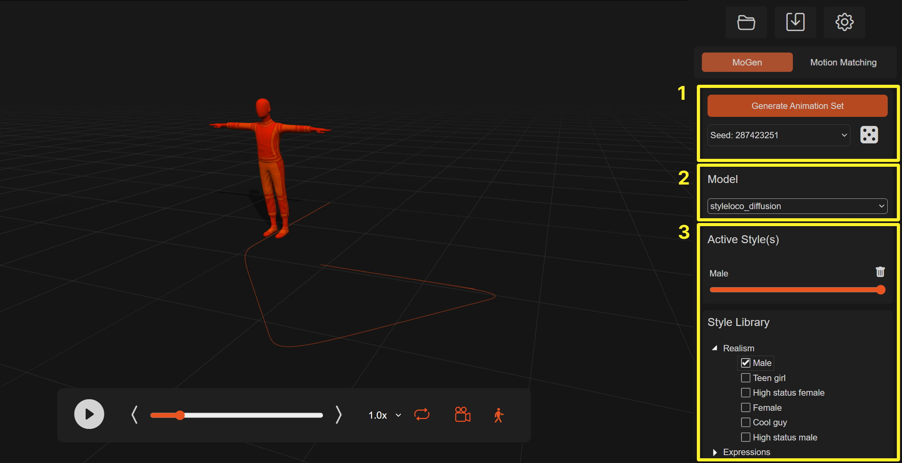
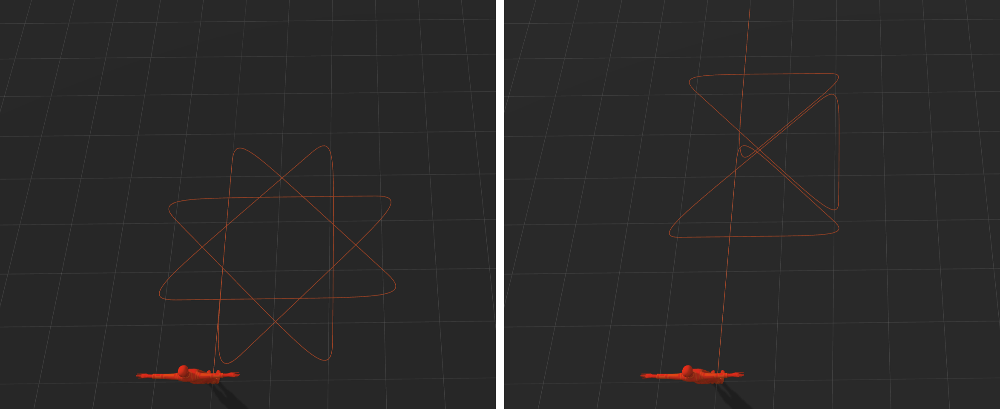
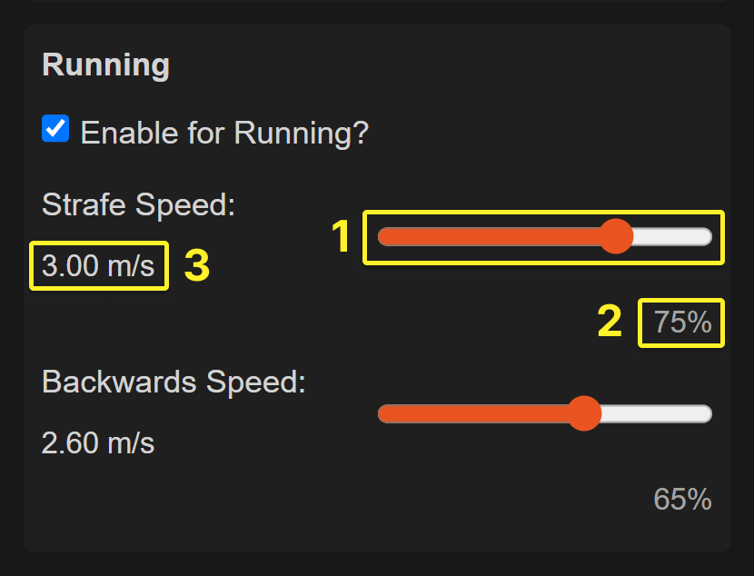

# User Interface Reference

!!! warning
    This is a **Beta feature**, so there may be some minor bugs & issues.

## Overview

The [MM-PRODUCT] user interface is located on the right side of the screen, once [MM-PRODUCT] has been selected via the top-right menu. It contains all the tools and controls needed to create your motion datasets:
 

The [MM PRODUCT] workflow is divided into three key phases:

1. [Configuration Setup](#configuration-setup)
    - Specify parameters based on your game's animation system to generate root motion **paths**. These paths will later be synthesized by our AI motion models to create your dataset.
2. [Path Viewer](#path-viewer)
    - Review the generated paths and confirm they meet your requirements before proceeding.
3. [Animation Generation](#animation-generation)
    - Choose the style(s) and seed for the animation generation process.

!!! tip
    Check out our [Motion Matching Tutorial](../how-to-guides/mm-tutorial.md) for a guided walkthrough on using [MM-PRODUCT] for motion matching!

## Configuration Setup

There are two ways to create your motion dataset in [MM PRODUCT]:

- [Simplified mode](#simplified-setup)  *The fastest way to create a dataset, adaptable for various animation systems.*
- [Custom mode](#custom-setup)  *Provides more granular control for users who need finer adjustments.*

You can switch between the two modes using the **Select Mode** option:
 

{width="500"}

### Simplified Setup

The Simplified Setup guides you through a series of questions about your animation system and the character you want to animate. Based on your input, the system will automatically generate a set of paths that provide full coverage for your character’s animation needs.

The process is divided into five steps:

#### Step 1 - Gait Selection

Select the gaits (e.g, walking, running, sprinting) that your character will use.

{width="500"}

#### Step 2 - Gait Configuration

Adjust the specifics of each gait, such as speeds & whether the character is able to strafe in this gait.

{width="500"}

| Property           | Description                                                           |
|--------------------|-----------------------------------------------------------------------|
| Can Strafe?        | Defines whether the character can strafe in this gait. This will affect which paths are generated.               |
| Max Speed          | The maximum speed that the character should reach while in this gait. This is also the target speed, which will be accelerated to when transitioning between gaits.|

#### Step 3 - Movement Style

Choose a preset Movement Style that will define how quickly your character turns & accelerates.

{width="500"}

!!! info
    For most scenarios, we recommend the **Realistic** movement style

| Movement&nbsp;Style     | Description                                                           |
|--------------------|-----------------------------------------------------------------------|
| Responsive         | Ideal for fast-paced gameplay with agile characters that require quick, precise movements.               |
| Realistic          | A balanced style blending responsiveness with realism, ideal for main characters or realistic gameplay.|
| Sluggish           | Suitable for slower, more weighted movement, perfect for injured characters or non-human NPCs like zombies or ogres.|

#### Step 4 - Strafe Speed Damping

Here, you can change the speeds at which the character moves while strafing and moving backwards. If your animation system's speeds are dynamically altered based on the character's movement direction, this is **very** important feature!
 

For a full breakdown on what this feature is & how it works, please refer to the [Strafe Speed Damping Reference](#strafe-speed-damping_1).

{width="500"}

| Property           | Description                                                           |
|--------------------|-----------------------------------------------------------------------|
| Enable&nbsp;for&nbsp;[Gait]  | Specifies whether strafe speed damping should be used for this gait.               |
| Strafe Speed       | Defines how much of the character's speed is maintained when strafing (Moving at an angle between 90&deg; and 135&deg;)|
| Backwards Speed    | Defines how much of the character's speed is maintained when moving backwards (Moving at an angle between 135&deg; and 180&deg;)|

#### Step 5 - Review

Review your settings and confirm their correctness before generating the paths. After clicking "Generate Paths", your paths will be generated and you will be taken to the [Path Viewer](#path-viewer).

#### Navigation Controls

At any point in the setup, you may press ***Prev Step*** to go back to the previous step, or ***Restart Setup*** to clear your settings and begin the Simplified Setup from scratch.

{width="500"}

### Custom Setup

The **Custom Setup** offers a flexible, modular approach for building your animation set. In this mode, you select a **Path Set** to define the types of motion paths to generate, and fine-tune the [generation parameters](#parameter-reference) to suit your needs.

Path sets group similar motions by function, providing more control over which animations to include. While [Simplified mode](#simplified-setup) uses animations from all available path sets and excludes unnecessary ones, Custom mode allows you to include any paths you feel are essential for your animation system.

#### Path Sets

The available path sets are as follows:

| Path Set             | Description                                                           |
|----------------------|-----------------------------------------------------------------------|
| Forward              | Paths typically needed for forward-facing movement. Also includes turn in place animations.           |
| Strafe               | Paths typically needed for strafe movement.                                                           |
| Acceleration         | Paths needed for transitioning between speeds. Selecting this path set exposes the **Min&nbsp;Speed** &nbsp;parameter. Paths created using this path set will accelerate between **Min&nbsp;Speed** and **Max&nbsp;Speed**.|
| Spirals              | Paths needed for systems where the character's movement can arc.           |
| Curves               | Paths typically used in motion-matching systems that use 'snaking' paths as part of a motion database.                                                           |
| Curves&nbsp;(Shallow) | The same as *Curves*, but with less sharp turns.                                                           |
| Extras               | Additional paths for specific scenarios, such as stop-turns, pirouettes, and strafe turns.   |

#TODO: Import Custom Path Sets

#### Parameter Reference

The Custom Setup interface features a **Path Set** dropdown, along with adjustable path generation parameters. Some parameters are initially hidden and will appear only when relevant, based on other selected options. When you first open the interface, you’ll see a simplified view (shown side-by-side here due to its length):

When using the PDC tool, you have these controls available to you:

##### Movement Settings
| Parameter            | Description                                                           |
|----------------------|-----------------------------------------------------------------------|
| Max Speed            | The speed that the character will attempt to accelerate to when generating paths. If the **Acceleration** path set is chosen, then this will be one of the target speeds the character will accelerate between.           |
| Min Speed            | When the **Acceleration** path set is chosen, this is one of two speeds that the character will accelerate between.                                                           |
| Acceleration   | The acceleration the character will use when increasing their speed|
| Deceleration   | The acceleration the character will use when decreasing their speed|

##### Turn Behaviour
| Parameter            | Description                                                           |
|----------------------|-----------------------------------------------------------------------|
| Turn Rate   | The speed at which the character will rotate during turns between segments, in degrees per second           |
| Easing Method   | Dictates how the character's rotation will interpolate between segments. Can be one of: `linear`, `ease_in_out`, `ease_in` or `ease_out`                         |
| Easing Curve   | When any easing method apart from linear is chosen, this dictates which of the typical mathematical easing curves to use.                         |

##### Strafe Speed Damping

!!! tip
    See the [Strafe Speed Damping Reference](#strafe-speed-damping_1) for more info. 

| Parameter            | Description                                                           |
|----------------------|-----------------------------------------------------------------------|
| Enable Strafe Damping                | Dictates whether strafe speed damping will be used while the character is strafing (moving at an angle between 90&deg; and 135&deg;)                                                           |
| Strafe Speed                 | How much of the character's speed is maintained when strafing.   |
| Enable Backwards Damping                  | Dictates whether strafe speed damping will be used while the character is strafing (moving at an angle between 135&deg; and 180&deg;)    |
| Backwards Speed                 | How much of the character's speed is maintained when moving backwards.        |

##### Duration Properties

| Parameter            | Description                                                           |
|----------------------|-----------------------------------------------------------------------|
| Segment Length                | How long each segment is (in frames) |
| Stop Duration                 | When stopping, how long the character remains stationary for (in frames)   |

##### Root Offset
| Parameter            | Description                                                           |
|----------------------|-----------------------------------------------------------------------|
| Root Offset          | The amount of yaw offset to apply to the root (in degrees).                                                   |

## Path Viewer

The Path Viewer interface is composed of five main elements:

1. **Viewport**
  The character enters a T-pose to indicate no animation is currently active, only root motion. While an animation is playing, the character will slide along the root motion path, visualised using an orange line.

2. **Playback Controls**
  Similar to the controls in MoGen, these allow you to control animation playback in the viewport. For more information, refer to the MoGen documentation.

3. **Path Previewer Window**
  This lets you select the path you'd like to view in the viewport. For paths created with the [Simplified Setup](#simplified-setup), *Category* and *Type* selectors will be available, to easily browse your animations.

4. **Continue To Generation**
  Press this button to proceed to the [Animation Generation](#animation-generation) screen. Be sure to view all paths and confirm you're satisfied before continuing.

5. **Exit Path Viewer**
  Press this button to return to the [Configuration Setup](#configuration-setup) phase. If you're unsatisfied with the generated paths, this allows you to modify your parameters and regenerate them.

## Animation Generation

The Animation Generation interface has two main components:

1. **Generation Panel**
  A seed is randomly generated for you by default. If you'd like to use a *custom seed*, click the seed dropdown and select 'Custom'. To generate a random, click the die icon. 
 
Once you're happy with your seed and style choices, click the 'Generate Animation Set' button to start generating your dataset.

2. **Model Picker**
 For users with access to multiple models, use this dropdown to select the one you want to generate your dataset with. If this option is hidden, you only have access to the base model, so you can skip this step.

3. **Style Picker**
  Select up to two styles to generate animations. If you choose more than one style, you can adjust the weights to change the bias towards one style or another. At least one style must be selected.

After configuring your settings, click the 'Generate Animation Set' button. Your paths will be sent to the server to begin generating the animation set. If successful, you'll see a confirmation message like this:

{width="500"}

At this point, you may need to wait between 1 and 10 minutes, depending on the size of the set. Once your dataset is ready, you'll receive an email with a download link to access your animations.

!!! info
    Download links are valid for **7 days**, so ensure you download your animation set before the link expires!

## Strafe Speed Damping

Many animation systems reduce a character's speed when strafing or moving backwards. If the generated animations do not account for this, it can cause issues where the character’s actual speed doesn’t match the root motion in the animation.
 

To address this, we have a *Strafe Speed Damping* feature that simulates the speed reduction your character will experience in your animation system. This results in slightly altered paths, as the target speed won’t remain constant throughout.

For example, below is a comparison between a path without strafe speed damping (left) and a path with strafe speed damping (right):

You can see how the segments where the character moves backwards are shorter. This occurs because the character’s speed is reduced during these portions of the path.
 

Once Strafe Speed Damping is enabled for a gait, or enabled in custom mode, you will be presented with a UI that contains three main features:

{width="500"}

1. **Input Slider**
  Adjusts the amount of strafe speed damping applied.

2. **Speed Damping Percent**
  Updates as the slider is moved. Shows the user how much of the forward speed is retained during strafe/backwards movement.

3. **Damped Speed**
  Updates as the slider is moved. Shows the user the exact speed that their character will be moving during strafe/backwards movement.
Calculated as `speed * damping_percent`.