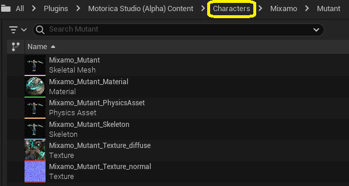
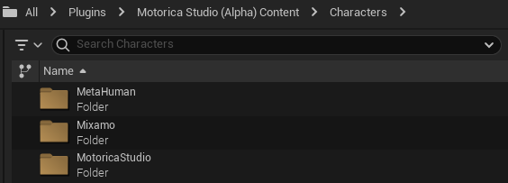

# Included assets
The plugin provides demo assets that you can use. For example, you can preview various pre-generated `Animation Sequence` assets or retarget them onto MetaHuman characters using the supplied `IK Rig` and `IK Retargeter` assets.

To view these assets, enable "Show Plugin Content" in the Content Browser settings.

And navigate to `Plugins > Motorica Studio Content`.

Note: The folder names may be different depending on the plugin version you are using.

## Animations

This folder contains animations adapted to the Motorica character, generated using MoGen inside the Motorica Studio editor. You can preview and use these animations without having to open the Motorica Studio editor at all!

If you wish to retarget these animations to non-Motorica characters, read about how to use the supplied retargeting assets on [this page](../retargeting/).

## Characters

Contains assets (textures, skeleton, materials, etc.) of various characters that you can retarget MoGen-generated animations to.

- **MetaHuman** - (Target skeleton) Used for retargeting to MetaHuman characters. Includes the default male body mesh. (Other meshes like the face are not included to keep the plugin file small.)
- **Mixamo** - (Target skeleton) Used for retargeting to Mixamo characters. Multiple characters are included with different body proportions.
- **MotoricaStudio** - (Source skeleton) This is the default Motorica Studio character from which animations are retargeted. All MoGen-generated animations are applied to this character by default.
- **UnrealEngine** - (Target skeleton) Used for retargeting to UE5 mannequin. Includes the default male / female body meshes.

## Internal

Various assets used internally by the plugin. You do not need to modify or use these assets.

## Levels

Example levels that you can use inside the Motorica Studio editor.

The default "Prototype" level, which the Motorica Studio editor launches with, is included here. To force Motorica Studio editor to launch with a different level than the provided one, you can:

- Modify the contents of `Level_Prototyping`
- Create your own level asset named `Level_Prototyping` and copy (or move) it to `Levels > Prototyping`. You will have to rename the original prototype level asset.

The Motorica Studio editor can load other levels besides the prototype one. To load another level, you need to:

1. Load the level asset in the main editor window.
2. Click the "globe icon" in the Motorica Studio editor.

## Retargeting
You can find an overview of retargeting assets on the [Retargeting](../retargeting/#assets) docs page.
