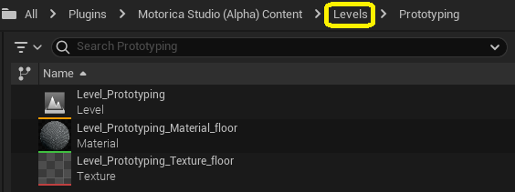

# Included assets
The plugin comes with premade assets that you can work with. For example, you can preview example MoGen-generated animations or retarget them onto MetaHuman characters using the supplied IK Rig and IK Retargeter asset.

To view these assets, enable "Show Plugin Content" in the Content Browser settings.

And navigate to `Plugins > Motorica Studio > Content`.

Note: The folder names may be different depending on the plugin version you are using.

## Animations

This folder contains animations adapted to the Motorica character, generated using MoGen inside the Motorica Studio editor. You can preview and use these animations without having to open the Motorica Studio editor at all!

If you wish to retarget these animations to non-Motorica characters, read about the assets inside the "Retargeting" folder further below.

## Characters

Contains assets (textures, skeleton, materials, etc.) of various characters that you can retarget MoGen-generated animations to.

- **MetaHuman** - Added for support of MetaHuman retargeting. Includes the default male / female body meshes. When retargeting, this character would be the retarget *Target*.
- **Mixamo** - Use these to preview how animations are affected when applied to different body proportions. When retargeting, this character would be the retarget *Target*.
- **MotoricaStudio** - This is the default character used throughout the plugin. All MoGen-generated animations are applied to the skeleton of this character by default. When retargeting, this character would be the retarget *Source*.

## Internal

Various assets used internally by the plugin. You do not need to modify or use these assets.

## Levels

Example levels that you can use inside the Motorica Studio editor.

The default "Prototype" level, which the Motorica Studio editor launches with, is included here. To force Motorica Studio editor to launch with a different level than the provided one, you can:
- Modify the contents of `Level_Prototyping`
- Create your own level asset named `Level_Prototyping` and copy (or move) it to `Levels > Prototyping`. You will have to rename the original prototype level asset.

The Motorica Studio editor can load other levels besides the prototype one. To load another level, you need to:
1. Load the asset in the main editor window by double-clicking it.
2. Click the "globe icon" in the Motorica Studio editor.

## Retargeting
You can find an explanation of retargeting assets in the [Retargeting](../retargeting/) docs page.
