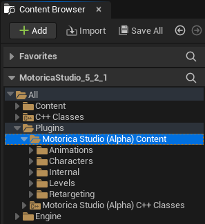
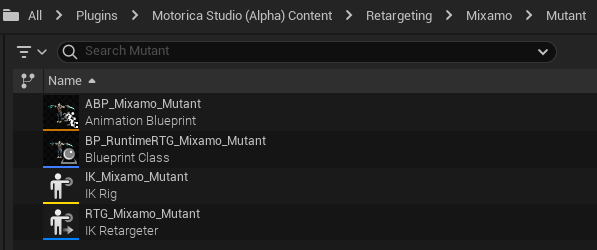
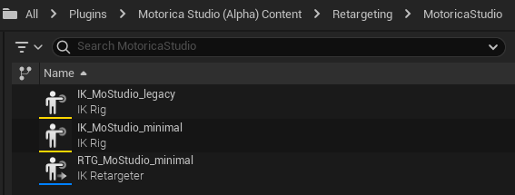

# Retargeting
Motorica Studio includes assets that demonstrate retargeting from the Motorica character to other characters.

*Note: Retargeting in UE 5.0 is not ideal. You are encouraged to use UE 5.1 and above. Example issues seen [here](https://forums.unrealengine.com/t/retargeting-root-bone-ue5/506512) and [here](https://forums.unrealengine.com/t/ue5-retargeted-root-motion-animations-have-innacurate-pelvis-hip-placement/514656)*.

## Assets
First, enable "Show Plugin Content" in the Content Browser settings.

Then, navigate to `Plugins > Motorica Studio > Content`. (The folders may look different depending on which version of Motorica Studio you are using.)

### Retargeting folder

- **BP_RuntimeRTG_Base** - A spawnable `Actor Blueprint` that sets up runtime retargeting between the Motorica skeleton and other skeletons. This blueprint serves as a base which other blueprints can extend from.
- **LS_RuntimeRTG** - A `Level Sequence` asset demonstrating runtime retargeting from the Motorica skeleton to a set of other skeletons.

### MetaHuman

- **ABP_MetaHuman_MoStudio** - `Animation Blueprint` used for runtime retargeting from the Motorica skeleton to the MetaHuman skeleton. It uses the `RTG_metahuman_MoStudio` IK Retargeter asset.
- **BP_RuntimeRTG_metahuman_MoStudio** - A spawnable `Actor Blueprint` that extends from `BP_RuntimeRTG_Base`. It sets up runtime retargeting from the Motorica skeleton to the MetaHuman skeleton using `ABP_metahuman_MoStudio`.
- **IK_metahuman_MoStudio** - `IK Rig` asset that configures the default MetaHuman skeleton for retargeting. This is identical to the default MetaHuman IK Rig *(confirmed UE 5.2)*.
- **RTG_metahuman_MoStudio** - `IK Retargeter` asset that retargets from the `IK_MoStudio` IK Rig to the `IK_metahuman_MoStudio` IK Rig. The MetaHuman retarget pose is edited to match the T-pose of the Motorica skeleton. IK retargeting is disabled.

### Mixamo

- **ABP_Mixamo_Mutant** - `Animation Blueprint` used for runtime retargeting from the Motorica skeleton to the Mixamo Mutant skeleton. It uses the `RTG_Mixamo_Mutant` IK Retargeter asset.
- **BP_RuntimeRTG_Mixamo_Mutant** - A spawnable `Actor Blueprint` that extends from `BP_RuntimeRTG_Base`. It sets up runtime retargeting from the Motorica skeleton to the Mixamo Mutant skeleton using `ABP_Mixamo_Mutant`.
- **IK_Mixamo_Mutant** - `IK Rig` asset that configures the Mixamo Mutant skeleton for retargeting. It contains bone chains for the spine, legs, arms, head and root, excluding fingers.
- **RTG_Mixamo_Mutant** - `IK Retargeter` asset that retargets from the `IK_MoStudio_minimal` IK Rig to the `IK_Mixamo_Mutant` IK Rig.

The assets above are for the *Mixamo Mutant* character. Other mixamo characters have similar assets.

### MotoricaStudio

- **ABP_MoStudio** - `Animation Blueprint` used for runtime retargeting from the Motorica skeleton to itself. It uses the `RTG_MoStudio` IK Retargeter asset.
- **BP_RuntimeRTG_MoStudio** - A spawnable `Actor Blueprint` that extends from `BP_RuntimeRTG_Base`. It sets up runtime retargeting from the Motorica skeleton to itself using `ABP_MoStudio`.
- **IK_MoStudio** - `IK Rig` asset that configures the Motorica skeleton for retargeting. It contains bone chains for the root, hips, spine, legs, arms, and head, except fingers. For compatibility, some bones like the root and shoulders have multiple chains. Find the ones that work best for you target skeleton. You can also copy and tweak the bone chains to improve retargeting to your character. Most `IK Retargeter` assets in the plugin use this IK Rig as the *retargeting source*.
- **IK_MoStudio_legacy** - This is the legacy `IK Rig` asset that was provided in *Motorica Studio v0.1.0* called `IK_Motorica`. You should use `IK_MoStudio` from now on. If you are using the old `IK_Motorica` IK Rig, update your references to point to `IK_MoStudio_legacy`.
- **RTG_MoStudio** - `IK Retargeter` asset that retargets from the `IK_MoStudio` IK Rig to itself. This is mainly used for debugging purposes.

### UE5 Mannequin

- **ABP_Mannequin_MoStudio** - `Animation Blueprint` used for runtime retargeting from the Motorica skeleton to the UE5 mannequin skeleton. It uses the `RTG_Mannequin_MoStudio` IK Retargeter asset.
- **BP_RuntimeRTG_Mannequin_MoStudio** - A spawnable `Actor Blueprint` that extends from `BP_RuntimeRTG_Base`. It sets up runtime retargeting from the Motorica skeleton to the UE5 mannequin skeleton using `ABP_Mannequin_MoStudio`.
- **IK_Mannequin_MoStudio** - `IK Rig` asset that configures the default UE5 mannequin skeleton for retargeting. This is identical to the default UE5 mannequin IK Rig *(confirmed in UE 5.2)*.
- **RTG_Mannequin_MoStudio** - `IK Retargeter` asset that retargets from the `IK_MoStudio` IK Rig to the `IK_Mannequin_MoStudio` IK Rig. The UE5 mannequin retarget pose is edited to match the T-pose of the Motorica skeleton. IK retargeting is disabled.

## How-To
A detailed guide on how to do retargeting (and how the included assets are set up) is missing. For now, you are encouraged to explore the [included assets](./#assets) in the plugin to understand more about how retargeting is set up.

You can also refer to these YouTube tutorials for more information:
- [Motorica - Generative AI for animation - Unreal](https://www.youtube.com/watch?v=-UY5rom6LGE)
- [Motorica - Generative AI for animation - Plugin Unreal](https://www.youtube.com/watch?v=3qmHzPH06O4)
- [Motorica a Metahuman con Mixamo Animation Retargeting 2](https://www.youtube.com/watch?v=R5euNHUcUec&t)
